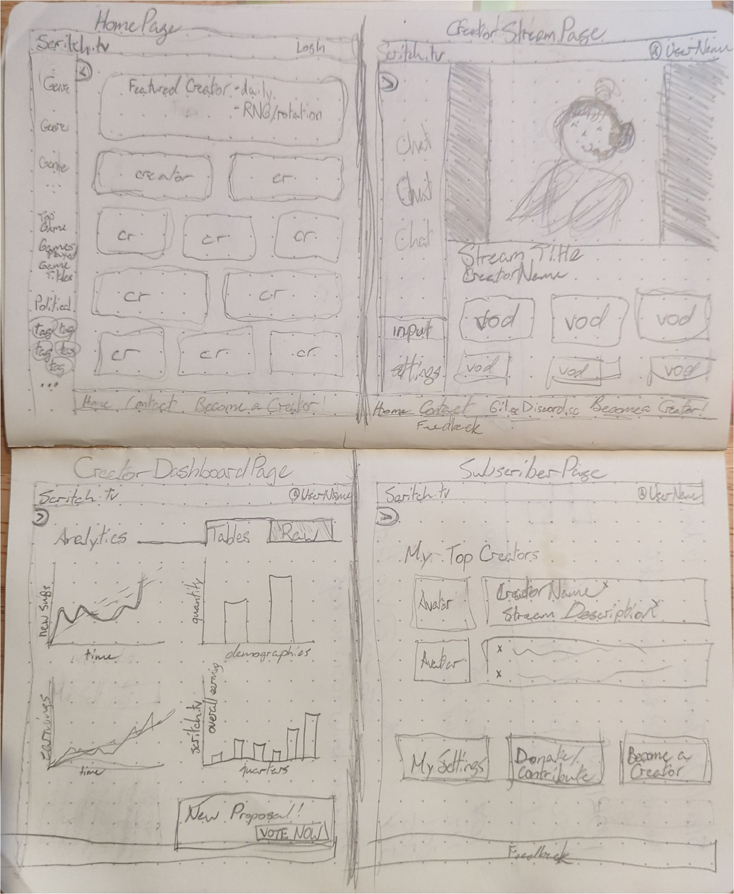


# Frog Stream 🐸 

## Overview  

Frog Stream is a streaming platform owned by the creators. The platform will host para-social interactions while providing a safe space for all users.

### Problem Space
  

Frog Stream is a collectivist alternative to traditional capitalist streaming platforms. Frog Stream provides a safe space for marginalised content creators. Without worrying about revenue from advertisers, creators on Frog Stream will own an equal share in the platform and make business and policy decisions together.
  

### User Profile  

Content Creators:

- streams their creative work, social commentary, and gaming to subscribers and followers

- owns an equal share in Frog Stream

- collect data on channel performance on the creator dashboard

- connect their OBS studio to the streaming platform

- host videos-on-demand (VODs) using YT API

- react to follower & subscriber chatter in the livestream chat

Subscribers:
- support their favourite creator directly

- contribute to the creative community

- get notified when a creator is live

- find like-minded creators to follow and support

- use the livestream chat to interact with their favourite creator

Followers:
- beginning their para-social relationship with the content creators

- use chat to interact with the creator

- become subscribers to the creator
  

### Features

A __user__ is any creator, subscriber, follower:
- a user can see the featured creators on the home page
- a user can visit other user pages
- a user can CRUD the information on their own user page
- a user can follow other users
- a user can remove followers & subscribers
- a user can subscribe to creators
- a user can interact with a livestream of a creator

A subscriber can do all of the above and:
- contribute a monthly subscription to the creator

A creator can do all of the above and:
- gain subscribers
- view channel dashboard

The __featured creators__ section randomly returns an array of creators. These creators are displayed in the component on the __Home Page__.

- on load/refresh of the Home Page, this section will randomly select another array of creators

Livestream interactions:
- a user can read and write in the livestream chat
- a subscriber can use personalized art and emojis in the chat
- a user can use a creator's soundboard
- a creator can enable and disable any livestream interaction for their whole audience or for individual users

  

## Implementation

  

### Tech Stack

Languages:

- JSX
- Sass
- SQL

Programs:

- VSCode
- Git
- MySQL

Client Libraries:

- react 
- react-router
- react-router-dom
- flv.js
- react-chat-widget
- mixpanel for stream health analysis

Server Libraries:

- node.js
- express
- knex
- cors
- obs-websocket-js
- socket.io
- bcryptjs
- passport.js
- UUIDv4
  

### APIs

  

__Research Task:__ find stream platform mock data from available APIs.

  

### Sitemap

- HomePage
- RegisterPage
- LogInPage
- UserPage
- CreatorStreamPage
- UserSettingsPage
- CreatorDashboardPage

  

### Mockups

  

  

### Data

  

To be updated.

  

### Endpoints

  

To be updated.

  

## Roadmap

  

- Draft the Pages in JSX components
- add functionality in JS
- Create express server enpoints
- Connect express server with react client through cors
- Style with Sass

  

---

  

## Future Implementations

- Establish video-on-demand hosting with cloudinary
- Scale Frog Stream up with AWS
- Establish FrogStream dot TV domain
- Add soundboard and custom emoji livestream interactions for creators and subscribers to use to interact with each other
- TOS for onboarding