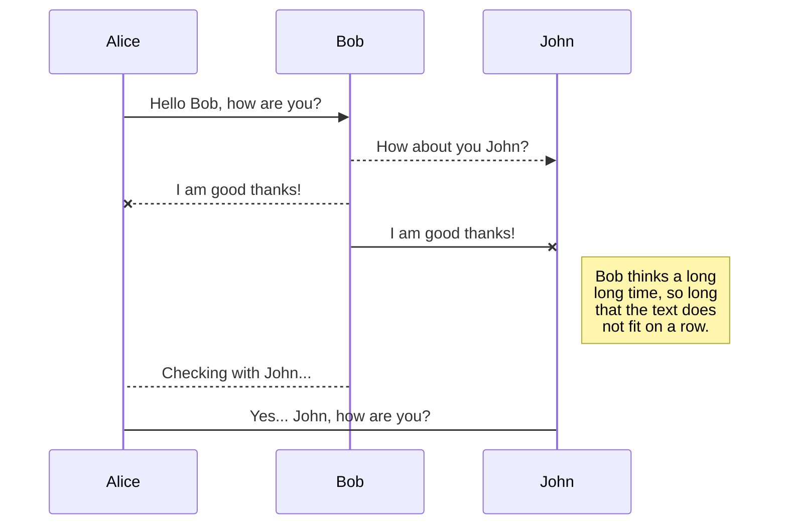
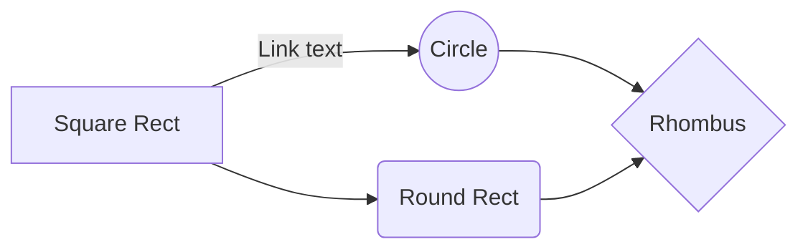

# Frog Stream 🐸 

## Overview  

Frog Stream is a streaming platform owned by the creators. The platform will host para-social interactions while providing a safe space for all users.

### Problem Space
  

Frog Stream is a collectivist alternative to traditional capitalist streaming platforms. Frog Stream provides a safe space for marginalised content creators. Without worrying about revenue from advertisers, creators on Frog Stream will own an equal share in the platform and make business and policy decisions together.
  

### User Profile  

Content Creators:

- streams their creative work, social commentary, and gaming to subscribers and followers

- owns an equal share in Frog Stream

- collect data on channel performance on the creator dashboard

- connect their OBS studio to the streaming platform

- host videos-on-demand (VODs)

- react to follower & subscriber chatter in the livestream chat

Subscribers:
- support their favourite creator directly

- contribute to the creative community

- get notified when a creator is live

- find like-minded creators to follow and support

- use the livestream chat to interact with their favourite creator

Followers:
- beginning their para-social relationship with the content creators

- use chat to interact with the creator

- become subscribers to the creator
  

### Features

A __user__ is any creator, subscriber, follower:
- a user can see the featured creators on the home page
- a user can visit other user pages
- a user can CRUD the information on their own user page
- a user can follow other users
- a user can remove followers & subscribers
- a user can subscribe to creators
- a user can interact with a livestream of a creator

A subscriber can do all of the above and:
- contribute a monthly subscription to the creator

A creator can do all of the above and:
- gain subscribers
- view channel dashboard

The __featured creators__ section randomly returns an array of creators. These creators are displayed in the component on the __Home Page__.

- on load/refresh of the Home Page, this section will randomly select another array of creators

Livestream interactions:
- a user can read and write in the livestream chat
- a subscriber can use personalized art and emojis in the chat
- a user can use a creator's soundboard
- a creator can enable and disable any 

  

## Implementation

  

### Tech Stack

  

List technologies that will be used in your app, including any libraries to save time or provide more functionality. Be sure to research any potential limitations.
Languages:
- JSX
- Sass
- SQL

Programs:
- VSCode
- Git
- MySQL

Client Libraries:
- react 
- react-router
- react-router-dom
- flv.js
- react-chat-widget

Server Libraries:
- node.js
- express
- knex
- obs-websocket-js
- socket.io
- bcryptjs
- passport.js
  

### APIs

  

__Research Task:__ find stream platform mock data from API.

  

### Sitemap

- HomePage
- RegisterPage
- LogInPage
- UserPage
- CreatorStreamPage
- UserSettingsPage
- CreatorDashboardPage

  

### Mockups

  

  

### Data

  

Describe your data and the relationships between the data points. You can show this visually using diagrams, or write it out.

  

### Endpoints

  

List endpoints that your server will implement, including HTTP methods, parameters, and example responses.

  

## Roadmap

  

Scope your project as a sprint. Break down the tasks that will need to be completed and map out timeframes for implementation working back from the capstone due date.

  

---

  

## Future Implementations

Your project will be marked based on what you committed to in the above document. Here, you can list any additional features you may complete after the MVP of your application is built, or if you have extra time before the Capstone due date.

# Markdown extensions

StackEdit extends the standard Markdown syntax by adding extra **Markdown extensions**, providing you with some nice features.

> **ProTip:** You can disable any **Markdown extension** in the **File properties** dialog.

## SmartyPants

SmartyPants converts ASCII punctuation characters into "smart" typographic punctuation HTML entities. For example:

|                |ASCII                          |HTML                         |
|----------------|-------------------------------|-----------------------------|
|Single backticks|`'Isn't this fun?'`            |'Isn't this fun?'            |
|Quotes          |`"Isn't this fun?"`            |"Isn't this fun?"            |
|Dashes          |`-- is en-dash, --- is em-dash`|-- is en-dash, --- is em-dash|

## KaTeX

You can render LaTeX mathematical expressions using [KaTeX](https://khan.github.io/KaTeX/):

The *Gamma function* satisfying $\Gamma(n) = (n-1)!\quad\forall n\in\mathbb N$ is via the Euler integral

$$
\Gamma(z) = \int_0^\infty t^{z-1}e^{-t}dt\,.
$$

> You can find more information about **LaTeX** mathematical expressions [here](http://meta.math.stackexchange.com/questions/5020/mathjax-basic-tutorial-and-quick-reference).

## UML diagrams

You can render UML diagrams using [Mermaid](https://mermaidjs.github.io/). For example, this will produce a sequence diagram:

And this will produce a flow chart:

